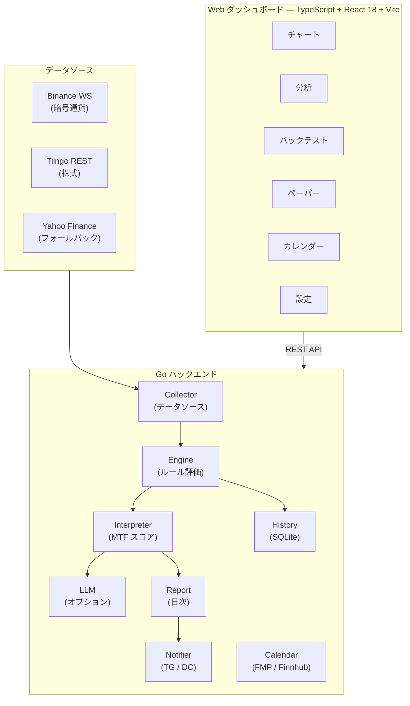

# ChartNagari

**🌐 [English](README.md) | [한국어](README.ko.md) | [日本語](README.ja.md)**

[](https://github.com/Ju571nK/ChartNagari/actions/workflows/ci.yml)
[](LICENSE)
[](go.mod)
[](Dockerfile)
[](https://www.linkedin.com/in/justin0830/)


> **ICT および Wyckoff 手法をマルチタイムフレームで自動化する唯一のオープンソースプラットフォーム
> — リアルタイムアラートと AI 解釈機能付き。
> セルフホスト。クラウド不要。**

---

## 5分で始められます

1. Clone → `.env` ファイルを1つ設定 → `docker compose up`
2. ChartNagari が米国株と暗号通貨を 1W / 1D / 4H / 1H タイムフレームで同時スキャン
3. ICT Order Block、Fair Value Gap、Wyckoff フェーズ変化、RSI シグナルが発生すると、
   Telegram（または Discord）アラートを受信 — AI 解釈オプション付き
4. すべてがローカルで実行 — データがマシンの外に出ることはありません

クラウドアカウント不要。サブスクリプション不要。API レート制限の心配なし。

---

## なぜ ChartNagari なのか

GitHub における ICT と Wyckoff 手法の自動化プロジェクトは驚くほど少ないのが現状です。
Wyckoff 自動化リポジトリのトップでもスター数は17、最も知られた ICT ライブラリは
アラートもバックテストも UI もない Python 関数の寄せ集めに過ぎません。

ChartNagari はそのギャップを埋めます：

| 必要な機能 | ステータス |
|---|---|
| マルチタイムフレーム ICT シグナル検出 (Order Blocks, FVGs, Liquidity Sweeps) | ✅ |
| Wyckoff フェーズ検出 (Accumulation, Distribution, Spring, Upthrust) | ✅ |
| リアルタイム Telegram / Discord アラート（クールダウン付き） | ✅ |
| AI 解釈オプション (Anthropic, OpenAI, Groq, Gemini) | ✅ |
| マルチタイムフレーム合意スコアリング | ✅ |
| シグナル品質スコアリング（出来高、ヒゲ比率、反転強度） | ✅ |
| 上位タイムフレーム(HTF)コンテキストフィルター（逆トレンドシグナル抑制） | ✅ |
| シグナルシーケンス追跡（sweep → displacement ボーナス） | ✅ |
| チャートシグナルカテゴリフィルター（ICT / Wyckoff / SMC / TA トグル） | ✅ |
| デモモード（サンプルデータでシグナル体験、セットアップ不要） | ✅ |
| ヒストリカルデータでのバックテスト | ✅ |
| セルフホスト、ローカルファースト、クラウド不要 | ✅ |
| AI 出力言語: `LLM_LANGUAGE: en \| ko \| ja` | ✅ |
| ガイド付き初回オンボーディング + AI シナリオスキャン | ✅ |

> **AI と共に構築** — このプロジェクトは [Claude Code](https://claude.ai/claude-code) とのバイブコーディングにより、すべて構築されました。

> **ローカルファースト** — すべてのデータはお使いのマシンに保存されます。クラウドアカウントなしで実行できます。

---

## 機能

- **30以上のトレーディングルール** — ICT (Order Blocks, FVG, Liquidity Sweeps, Breaker Blocks)、Wyckoff (Spring, Upthrust, Accumulation/Distribution)、SMC (BOS, CHoCH)、一般 TA (RSI, EMA, 出来高)、14種のローソク足パターン
- **マルチタイムフレーム分析** — 1W、1D、4H、1H を並列スキャン
- **シグナル品質スコアリング** — すべてのシグナルが同等ではありません。Sweep は出来高比率、ヒゲの深さ、反転強度で評価。FVG はギャップサイズ対 ATR とインパルス強度で評価
- **上位タイムフレーム(HTF)コンテキストフィルター** — 1D/1W のトレンド方向に反する 1H/4H シグナルを抑制
- **シグナルシーケンス追跡** — 同方向の sweep 後に displacement が発生するとボーナススコア。マルチパターン検出
- **Wyckoff フェーズブースト** — accumulation/markup は LONG シグナルを強化、distribution/markdown は SHORT シグナルを強化
- **チャートカテゴリフィルター** — ICT / Wyckoff / SMC / TA シグナルグループをワンクリックでオン/オフ
- **デモモード** — シンボル追加や API キーなしでサンプルデータでシグナルエンジンを体験
- **マルチタイムフレーム合意** — 一致するタイムフレームの数でシグナルをランキング
- **AI 解釈レイヤー** — オプションの LLM コメンタリー (Anthropic, OpenAI, Groq, Gemini)
- **Telegram & Discord アラート** — アラートスパム防止のためのクールダウン設定
- **バックテスト & ペーパートレーディング** — 実運用前にヒストリカルデータでルールを検証
- **Web ダッシュボード** — React フロントエンド、ガイド付き初回オンボーディング、Settings UI、AI シナリオカード
- **複数データソース** — Binance WebSocket（暗号通貨、無料）、Tiingo（株式、推奨）、Yahoo Finance（フォールバック）
- **経済カレンダー** — 米国マクロイベントトラッカー（FMP または Finnhub）；高インパクトイベント前の Telegram 事前アラート

---

## アーキテクチャ



---

## クイックスタート — Docker

```bash
# 1. Clone
git clone https://github.com/Ju571nK/ChartNagari.git
cd ChartNagari

# 2. 設定
cp .env.example .env
# .env を編集 — 最低限1つのアラート送信先（Telegram または Discord）を設定

# 3. 実行
docker compose up -d

# 4. ダッシュボードを開く
open http://localhost:8080
```

---

## クイックスタート — ローカル開発

**前提条件:** Go 1.26+、Node.js 20+

```bash
# バックエンド
go mod download
go run ./cmd/server

# フロントエンド（別ターミナル）
cd web
npm install
npm run dev        # :5173 開発サーバー、API を :8080 にプロキシ
```

または Makefile を使用：

```bash
make build-all     # フロントエンド + バックエンドバイナリをビルド
make run           # ビルドしてサーバーを起動
make test          # 全 Go テストを実行
```

---

## 環境変数

`.env.example` を `.env` にコピーし、必要な値を入力してください。アラートを設定しなくてもサーバーは起動します — 実際に使用する機能の変数のみ設定すれば問題ありません。

| 変数 | 必須 | デフォルト | 説明 |
|---|---|---|---|
| `ENV` | いいえ | `development` | `development` \| `production` |
| `SERVER_PORT` | いいえ | `8080` | HTTP リスニングポート |
| `LOG_LEVEL` | いいえ | `debug` | `debug` \| `info` \| `warn` \| `error` |
| `DB_PATH` | いいえ | `./data/chart_analyzer.db` | SQLite ファイルパス |
| `BINANCE_API_KEY` | いいえ | — | Binance API キー（公開 WebSocket はキー不要） |
| `BINANCE_SECRET_KEY` | いいえ | — | Binance シークレットキー |
| `TIINGO_API_KEY` | いいえ | — | 設定すると Yahoo Finance の代わりに Tiingo を使用 |
| `TIINGO_POLL_INTERVAL` | いいえ | `900` | ポーリング間隔（秒）（無料プラン：900推奨） |
| `YAHOO_POLL_INTERVAL` | いいえ | `60` | Yahoo Finance ポーリング間隔（秒） |
| `TELEGRAM_BOT_TOKEN` | いいえ* | — | @BotFather から取得したトークン |
| `TELEGRAM_CHAT_ID` | いいえ* | — | チャット、グループ、またはチャンネル ID |
| `DISCORD_WEBHOOK_URL` | いいえ* | — | Discord 受信 Webhook URL |
| `ALERT_COOLDOWN_HOURS` | いいえ | `4` | 同一シンボル+ルールの再アラートまでの時間 |
| `LLM_PROVIDER` | いいえ | — | `anthropic` \| `openai` \| `groq` \| `gemini` |
| `ANTHROPIC_API_KEY` | いいえ | — | `LLM_PROVIDER=anthropic` の場合に必要 |
| `OPENAI_API_KEY` | いいえ | — | `LLM_PROVIDER=openai` の場合に必要 |
| `GROQ_API_KEY` | いいえ | — | `LLM_PROVIDER=groq` の場合に必要 |
| `GEMINI_API_KEY` | いいえ | — | `LLM_PROVIDER=gemini` の場合に必要 |
| `AI_MIN_SCORE` | いいえ | `12.0` | AI 解釈をトリガーする最小 MTF スコア |
| `LLM_LANGUAGE` | いいえ | `en` | AI 出力言語: `en` \| `ko` \| `ja` |
| `ALPHAVANTAGE_API_KEY` | いいえ | — | 20年分の SPY 日足データ取得用 |

*アラート送信先が1つ以上設定されていないとアラートは送信されませんが、サーバーは正常に動作します。

---

## 設定ファイル

| ファイル | 用途 |
|---|---|
| `config/rules.yaml` | 個別トレーディングルールの有効化/無効化とパラメータ設定 |
| `config/symbols.yaml` | 監視対象シンボルリスト（株式および暗号通貨） |
| `config/timeframes.yaml` | 資産クラスごとのタイムフレーム設定 |

---

## 新しいルールの追加

1. `internal/methodology/<category>/` に `rule.AnalysisRule` インターフェースを実装するファイルを作成します。
2. `config/rules.yaml` に一意の ID、カテゴリ、デフォルトパラメータとともに登録します。
3. ルールファイルと同じ場所に `_test.go` ファイルでテーブル駆動テストを追加します。
4. `go test ./...` を実行 — PR を作成する前にすべてのテストが通る必要があります。

完全なワークフローについては `CONTRIBUTING.md` をご覧ください。

---

## テストの実行

```bash
# 全テスト
go test ./...

# Race detector 付き
go test -race ./...

# カバレッジレポート
make test-coverage   # coverage.html を開く
```

---

## コントリビューション

開発環境のセットアップ、コードスタイル、PR チェックリストについては [CONTRIBUTING.md](CONTRIBUTING.md) をご覧ください。

---

## ライセンス

MIT — [LICENSE](LICENSE) を参照してください。

## ビルダー

[Justin](https://www.linkedin.com/in/justin0830/) が開発 — Claude Code とのバイブコーディングを通じて、AI 支援開発の探求と金融市場の知見の応用に取り組んでいます。
