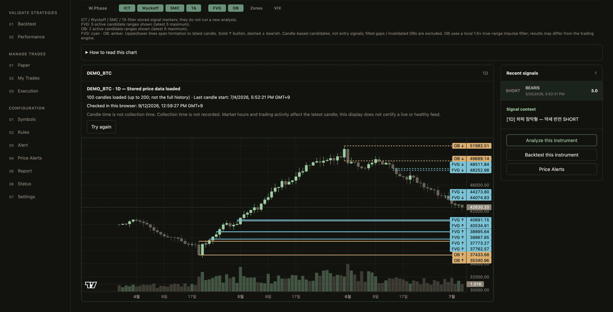

# ChartNagari

Forex・米国株・暗号資産を調べるセルフホスト型リサーチワークスペースです。ICT/SMCのチャート情報から通知、戦略の検証まで利用できます。

[デモを試す](https://ju571nk.github.io/ChartNagari/) · [最新リリース](https://github.com/Ju571nK/ChartNagari/releases/latest) · [始める](#始める)

[English](README.md) · [한국어](README.ko.md) · [日本語](README.ja.md)

*2026年9月12日のmainビルドを撮影しました。サンプルのローソク足を使った画面ツアーであり、リアルタイムの相場ではありません。[静止画を見る](docs/screenshots/README.md)。*

## 気になる銘柄を、一つの流れで

- **パターンを視覚的に確認。** 初心者向けの表示から始め、エキスパートモードでFVG・オーダーブロック・シグナルを比較できます。
- **画面を移っても同じ銘柄で。** 選択した銘柄と時間足をチャート・分析・バックテストで共有します。
- **通知を自分に合わせて。** ウォッチリスト、価格アラート、Telegram・Discord通知を管理します。
- **実行前に検証。** 履歴データの準備状況を確認し、バックテストやペーパートレードで振り返ります。
- **設定はブラウザーから。** データ提供元、任意のAI機能、接続情報をWeb画面で設定します。

日本語・英語・韓国語のUIに対応しています。AI解説は任意で、ローカルのOllamaも利用できます。

## 新しくなったこと

**最新の正式リリース：[v2.15.0.0 — Forex watchlist profiles and Telegram wording](https://github.com/Ju571nK/ChartNagari/releases/tag/v2.15.0.0)**

Forexのウォッチリストに資産別の通知プロファイルを適用し、銘柄ごとにLONG/SHORTのTelegram文面を保存できます。

**今回のリリースに含まれる改善**

- ICT/SMC、一般テクニカル分析、ローソク足ルールを含むForex既定プロファイル。明示的に設定したプロファイルは保持されます。
- 銘柄ごとのLONG/SHORT Telegram文面を固定サンプルでプレビューし、明示的に保存または方向別にリセットできます。
- 文面がない通知は従来どおりです。既存DBを置き換えず、専用テーブルを自動作成します。

更新する方は、サーバー再起動前に[リリースノート](docs/releases/v2.15.0.0.md)と[設定ガイド](SETTINGS.md)を確認してください。

## 始める

Forexを使う方は[5分で設定するキー不要のForexガイド](docs/FOREX.md)をご覧ください。
Forexの[サンプル画面デモ](docs/assets/forex-demo.gif)はサンプルデータを使用します。
実際のデータプロバイダー接続やリリースQAを示すものではありません。
Yahoo FinanceのFXデータはAPIキーなしで既定利用できますが、有意な出来高は
なく、金・銀には先物価格のプロキシを使います。ガイドでは任意のOANDA利用資格、
提供元ごとの足の整列、バックテスト費用の制限も説明しています。

**まず試すなら** [ブラウザーデモ](https://ju571nk.github.io/ChartNagari/)を開いてください。保存済みのサンプルデータを使用します。実際のデータ収集、設定の永続化、外部サービスとの接続にはセルフホスト版が必要です。

**自分の銘柄を登録するなら** [インストールガイド](docs/getting-started.md)でローカルまたはDockerの手順を確認し、次の順に進めてください。

1. **Symbols**で銘柄を追加します。
2. **Chart**で時間足を選び、初心者モードから確認します。
3. **Settings**で必要なデータ・AI・通知サービスだけを接続します。

既存ユーザーは更新前に[YAML設定の移行ガイド](SETTINGS.md)を確認してください。一般設定は保存後に再起動が必要で、画面にも案内されます。

## ご利用にあたって

ChartNagariはリサーチツールであり、投資助言ではありません。FVG・OBは参考用の候補領域で、売買指示ではありません。バックテストやペーパートレードの結果は将来の利益を保証しません。

DBと設定はローカルに保存されます。有効にした相場データ・クラウドAI・通知機能は各提供元と通信します。利用条件、料金、取得制限はサービスによって異なります。設定を保存するだけで注文アダプターが起動することはありません。

## 詳しく知る

[設定・アップグレード](SETTINGS.md) · [アーキテクチャ](docs/architecture.md) · [開発・貢献ガイド](CONTRIBUTING.md) · [問題の報告](https://github.com/Ju571nK/ChartNagari/issues)

Justinによるオープンソースプロジェクト。[MIT License](LICENSE)。
