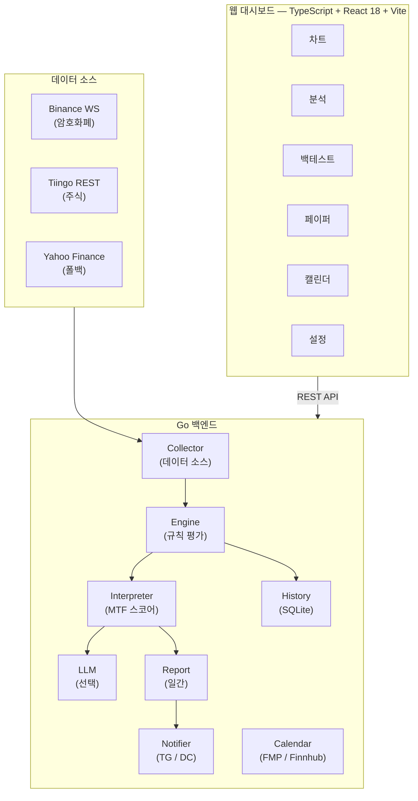

# ChartNagari

**🌐 [English](README.md) | [한국어](README.ko.md) | [日本語](README.ja.md)**

[](https://github.com/Ju571nK/ChartNagari/actions/workflows/ci.yml)
[](LICENSE)
[](go.mod)
[](Dockerfile)



> **ICT 및 Wyckoff 방법론을 멀티 타임프레임에서 자동화하는 유일한 오픈소스 플랫폼
> — 실시간 알림과 AI 해석 기능 포함.
> 셀프 호스팅. 클라우드 불필요.**

---

## 5분 만에 시작하기

1. Clone → `.env` 파일 하나 설정 → `docker compose up`
2. ChartNagari가 미국 주식과 암호화폐를 1W / 1D / 4H / 1H 타임프레임으로 동시 스캔
3. ICT Order Block, Fair Value Gap, Wyckoff 국면 전환, RSI 시그널이 발생하면
   Telegram (또는 Discord) 알림 수신 — AI 해석 옵션 포함
4. 모든 것이 로컬에서 실행 — 데이터가 외부로 나가지 않음

클라우드 계정 불필요. 구독 불필요. API 요청 제한 걱정 없음.

---

## 왜 ChartNagari인가

GitHub에서 ICT와 Wyckoff 방법론 자동화 프로젝트는 놀라울 정도로 적습니다.
상위 Wyckoff 자동화 레포의 스타는 17개에 불과하고, 가장 잘 알려진 ICT 라이브러리는
알림도, 백테스트도, UI도 없는 Python 함수 모음에 불과합니다.

ChartNagari가 그 빈자리를 채웁니다:

| 필요한 기능 | 상태 |
|---|---|
| 멀티 타임프레임 ICT 시그널 감지 (Order Blocks, FVGs, Liquidity Sweeps) | ✅ |
| Wyckoff 국면 감지 (Accumulation, Distribution, Spring, Upthrust) | ✅ |
| 실시간 Telegram / Discord 알림 (쿨다운 지원) | ✅ |
| AI 해석 옵션 (Anthropic, OpenAI, Groq, Gemini) | ✅ |
| 멀티 타임프레임 합의 스코어링 | ✅ |
| 시그널 품질 스코어링 (거래량, 꼬리 비율, 반전 강도) | ✅ |
| 상위 타임프레임(HTF) 컨텍스트 필터 (역추세 시그널 억제) | ✅ |
| 시그널 시퀀스 추적 (sweep → displacement 보너스) | ✅ |
| 차트 시그널 카테고리 필터 (ICT / Wyckoff / SMC / TA 토글) | ✅ |
| 데모 모드 (샘플 데이터로 시그널 체험, 설정 불필요) | ✅ |
| 히스토리컬 데이터 백테스트 | ✅ |
| 셀프 호스팅, 로컬 우선, 클라우드 불필요 | ✅ |
| AI 출력 언어: `LLM_LANGUAGE: en \| ko \| ja` | ✅ |
| 가이드 기반 첫 실행 온보딩 + AI 시나리오 스캔 | ✅ |

> **AI와 함께 만든 프로젝트** — [Claude Code](https://claude.ai/claude-code)와의 바이브 코딩으로 처음부터 끝까지 빌드되었습니다.

> **로컬 우선** — 모든 데이터는 사용자 머신에 남습니다. 클라우드 계정 없이 실행 가능합니다.

---

## 기능

- **30개 이상의 트레이딩 규칙** — ICT (Order Blocks, FVG, Liquidity Sweeps, Breaker Blocks), Wyckoff (Spring, Upthrust, Accumulation/Distribution), SMC (BOS, CHoCH), 일반 TA (RSI, EMA, 거래량), 14개 캔들스틱 패턴
- **멀티 타임프레임 분석** — 1W, 1D, 4H, 1H 병렬 스캔
- **시그널 품질 스코어링** — 모든 시그널이 동일하지 않습니다. Sweep는 거래량 비율, 꼬리 깊이, 반전 강도로 평가. FVG는 갭 크기 대비 ATR과 임펄스 강도로 평가
- **상위 타임프레임(HTF) 컨텍스트 필터** — 1D/1W 추세 방향과 반대되는 1H/4H 시그널 억제
- **시그널 시퀀스 추적** — 같은 방향의 sweep 후 displacement 발생 시 보너스 점수. 멀티 패턴 감지
- **Wyckoff 국면 부스팅** — accumulation/markup은 LONG 시그널 강화, distribution/markdown은 SHORT 시그널 강화
- **차트 카테고리 필터** — ICT / Wyckoff / SMC / TA 시그널 그룹을 클릭 한 번으로 켜기/끄기
- **데모 모드** — 심볼 추가나 API 키 없이 샘플 데이터로 시그널 엔진 체험
- **멀티 타임프레임 합의** — 동의하는 타임프레임 수에 따라 시그널 순위 결정
- **AI 해석 레이어** — 선택적 LLM 코멘터리 (Anthropic, OpenAI, Groq, Gemini)
- **Telegram & Discord 알림** — 알림 스팸 방지를 위한 쿨다운 설정 가능
- **백테스트 & 페이퍼 트레이딩** — 실전 전 히스토리컬 데이터로 규칙 검증
- **웹 대시보드** — React 프론트엔드, 가이드 기반 첫 실행 온보딩, Settings UI, AI 시나리오 카드
- **다중 데이터 소스** — Binance WebSocket (암호화폐, 무료), Tiingo (주식, 권장), Yahoo Finance (폴백)
- **경제 캘린더** — 미국 매크로 이벤트 트래커 (FMP 또는 Finnhub); 고영향 발표 전 Telegram 사전 알림

---

## 아키텍처



---

## 빠른 시작 — Docker

```bash
# 1. Clone
git clone https://github.com/Ju571nK/ChartNagari.git
cd ChartNagari

# 2. 설정
cp .env.example .env
# .env 편집 — 최소한 하나의 알림 대상(Telegram 또는 Discord) 설정

# 3. 실행
docker compose up -d

# 4. 대시보드 열기
open http://localhost:8080
```

---

## 빠른 시작 — 로컬 개발

**사전 요구사항:** Go 1.26+, Node.js 20+

```bash
# 백엔드
go mod download
go run ./cmd/server

# 프론트엔드 (별도 터미널)
cd web
npm install
npm run dev        # :5173 개발 서버, API를 :8080으로 프록시
```

또는 Makefile 사용:

```bash
make build-all     # 프론트엔드 + 백엔드 바이너리 빌드
make run           # 빌드 후 서버 시작
make test          # 전체 Go 테스트 실행
```

---

## 환경 변수

`.env.example`을 `.env`로 복사하고 필요한 값을 채우세요. 알림 설정 없이도 서버는 정상 시작됩니다 — 실제 사용하는 기능의 변수만 설정하면 됩니다.

| 변수 | 필수 | 기본값 | 설명 |
|---|---|---|---|
| `ENV` | 아니오 | `development` | `development` \| `production` |
| `SERVER_PORT` | 아니오 | `8080` | HTTP 리스닝 포트 |
| `LOG_LEVEL` | 아니오 | `debug` | `debug` \| `info` \| `warn` \| `error` |
| `DB_PATH` | 아니오 | `./data/chart_analyzer.db` | SQLite 파일 경로 |
| `BINANCE_API_KEY` | 아니오 | — | Binance API 키 (공개 WebSocket은 키 불필요) |
| `BINANCE_SECRET_KEY` | 아니오 | — | Binance 시크릿 키 |
| `TIINGO_API_KEY` | 아니오 | — | 설정 시 Yahoo Finance 대신 Tiingo 사용 |
| `TIINGO_POLL_INTERVAL` | 아니오 | `900` | 폴링 간격(초) (무료 티어: 900 권장) |
| `YAHOO_POLL_INTERVAL` | 아니오 | `60` | Yahoo Finance 폴링 간격(초) |
| `TELEGRAM_BOT_TOKEN` | 아니오* | — | @BotFather에서 발급받은 토큰 |
| `TELEGRAM_CHAT_ID` | 아니오* | — | 채팅, 그룹, 또는 채널 ID |
| `DISCORD_WEBHOOK_URL` | 아니오* | — | Discord 수신 Webhook URL |
| `ALERT_COOLDOWN_HOURS` | 아니오 | `4` | 동일 심볼+규칙 재알림까지의 시간 |
| `LLM_PROVIDER` | 아니오 | — | `anthropic` \| `openai` \| `groq` \| `gemini` |
| `ANTHROPIC_API_KEY` | 아니오 | — | `LLM_PROVIDER=anthropic` 시 필요 |
| `OPENAI_API_KEY` | 아니오 | — | `LLM_PROVIDER=openai` 시 필요 |
| `GROQ_API_KEY` | 아니오 | — | `LLM_PROVIDER=groq` 시 필요 |
| `GEMINI_API_KEY` | 아니오 | — | `LLM_PROVIDER=gemini` 시 필요 |
| `AI_MIN_SCORE` | 아니오 | `12.0` | AI 해석을 트리거하는 최소 MTF 점수 |
| `LLM_LANGUAGE` | 아니오 | `en` | AI 출력 언어: `en` \| `ko` \| `ja` |
| `ALPHAVANTAGE_API_KEY` | 아니오 | — | 20년 일간 SPY 데이터 조회용 |

*알림 대상이 하나 이상 설정되어야 알림이 발송되지만, 설정 없이도 서버는 정상 작동합니다.

---

## 설정 파일

| 파일 | 용도 |
|---|---|
| `config/rules.yaml` | 개별 트레이딩 규칙 활성화/비활성화 및 파라미터 설정 |
| `config/symbols.yaml` | 모니터링할 심볼 목록 (주식 및 암호화폐) |
| `config/timeframes.yaml` | 자산 클래스별 타임프레임 설정 |

---

## 새 규칙 추가하기

1. `internal/methodology/<category>/`에 `rule.AnalysisRule` 인터페이스를 구현하는 파일 생성.
2. `config/rules.yaml`에 고유 ID, 카테고리, 기본 파라미터와 함께 등록.
3. 규칙 파일 옆에 `_test.go` 파일로 테이블 기반 테스트 추가.
4. `go test ./...` 실행 — PR 제출 전 모든 테스트가 통과해야 합니다.

전체 워크플로우는 `CONTRIBUTING.md`를 참고하세요.

---

## 테스트 실행

```bash
# 전체 테스트
go test ./...

# Race detector 포함
go test -race ./...

# 커버리지 리포트
make test-coverage   # coverage.html 열기
```

---

## 기여하기

개발 환경 설정, 코드 스타일, PR 체크리스트는 [CONTRIBUTING.md](CONTRIBUTING.md)를 참고하세요.

---

## 라이선스

MIT — [LICENSE](LICENSE) 참고.

## 만든 사람

Justin — Claude Code와의 바이브 코딩을 통해 AI 기반 개발을 탐구하고 금융 시장 지식을 적용하고 있습니다.
