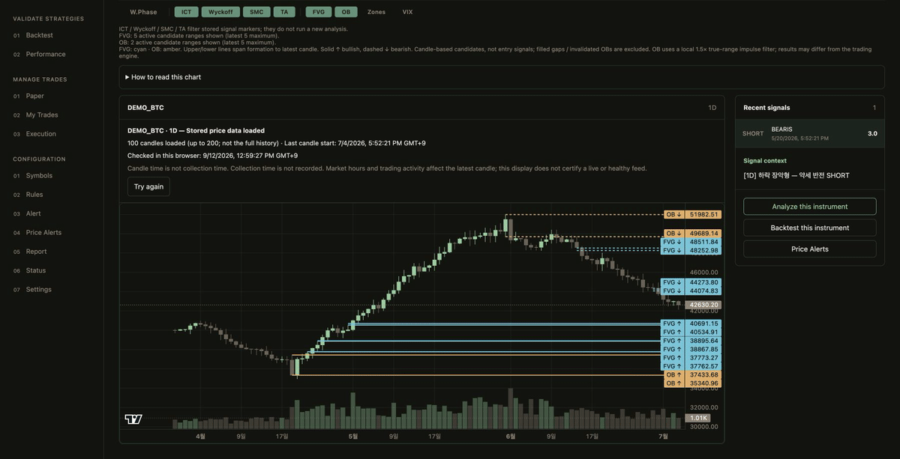

# ChartNagari

미국 주식과 암호화폐를 살펴보는 나만의 리서치 공간. 차트 패턴 확인부터 알림 설정, 전략 검토까지 한곳에서 이어집니다.

[데모 체험](https://ju571nk.github.io/ChartNagari/) · [최신 릴리즈](https://github.com/Ju571nK/ChartNagari/releases/latest) · [시작하기](#시작하기)

[English](README.md) · [한국어](README.ko.md) · [日本語](README.ja.md)

*2026년 9월 12일 현재 main 빌드를 직접 촬영했습니다. 샘플 캔들을 사용한 짧은 화면 투어이며 실시간 시세가 아닙니다. [정지 화면 보기](docs/screenshots/README.md).*

## 관심 종목을 살펴보는 흐름, 한곳에서

- **패턴을 눈으로 확인하세요.** 초보자 화면으로 시작하고, 전문가 모드에서 FVG·오더블록·신호 표시를 비교할 수 있습니다.
- **화면을 옮겨도 맥락은 그대로입니다.** 선택한 종목과 시간봉으로 차트 → 분석 → 백테스트를 이어갑니다.
- **알림을 내 방식으로 맞추세요.** 관심 종목, 가격 알림, Telegram·Discord 알림을 관리합니다.
- **실행 전에 검토하세요.** 이력 데이터의 준비 상태를 확인하고 백테스트와 모의매매로 살펴봅니다.
- **설정은 웹에서 바꾸세요.** 데이터 공급자, 선택적 AI 기능, 연결 설정을 웹 화면에서 관리합니다.

한국어·영어·일본어 UI를 지원합니다. AI 해석은 선택 사항이며, 로컬 Ollama도 사용할 수 있습니다.

## 무엇이 달라졌나요?

**최신 정식 릴리즈: [v2.13.0.0 — Web Settings & Clearer Charts](https://github.com/Ju571nK/ChartNagari/releases/tag/v2.13.0.0)**

목적별 탐색 메뉴, 차트 옆 신호 패널, 차트·분석·백테스트 간 종목과 시간봉 연결이 추가되었습니다.

**이번 릴리즈에 포함된 개선**

- 색상과 건수로 구분되는 FVG·OB 후보 영역 표시
- 로딩·데이터 없음·재시도 안내와 백테스트 이력 점검
- YAML 기반 웹 설정, 비밀키 마스킹과 명시적 삭제
- 종목 설정, 알림 저장, 시간봉별 신호 표시, VIX 수집 수정

기존 사용자는 서버를 재시작하기 전에 [YAML 전환 안내](SETTINGS.md)와 [릴리즈 노트](docs/releases/v2.13.0.0.md)를 확인하세요.

## 시작하기

**먼저 둘러보고 싶다면** [브라우저 데모](https://ju571nk.github.io/ChartNagari/)를 열어보세요. 데모는 저장된 샘플 데이터를 사용합니다. 실제 데이터 수집, 설정 저장, 외부 서비스 연결은 직접 실행한 서버에서 이용합니다.

**내 관심 종목을 등록하려면** [설치 안내](docs/getting-started.md)에 따라 로컬 또는 Docker로 실행한 뒤:

1. **Symbols**에서 관심 종목을 등록합니다.
2. **Chart**에서 시간봉을 선택하고 초보자 모드로 살펴봅니다.
3. **Settings**에서 필요한 데이터·AI·알림 서비스만 연결합니다.

기존 버전을 사용 중이라면 업그레이드 전에 [YAML 설정 이전 안내](SETTINGS.md)를 확인하세요. 일반 설정은 저장 후 재시작이 필요하며 화면에도 안내됩니다.

## 사용 전에 알아두세요

ChartNagari는 리서치 도구이며 투자 조언이 아닙니다. FVG·OB는 참고용 후보 영역이지 매매 지시가 아닙니다. 백테스트와 모의매매 결과는 미래 수익을 보장하지 않습니다.

DB와 설정은 로컬에 저장됩니다. 활성화한 시세·클라우드 AI·알림 기능은 해당 외부 서비스와 통신하며, 이용 조건과 비용·조회 한도는 공급자에 따라 달라집니다. 설정 저장만으로 주문 실행기가 시작되지는 않습니다.

## 더 알아보기

[설정·업그레이드](SETTINGS.md) · [아키텍처](docs/architecture.md) · [개발·기여 안내](CONTRIBUTING.md) · [문제 제보](https://github.com/Ju571nK/ChartNagari/issues)

Justin이 만드는 오픈소스 프로젝트입니다. [MIT License](LICENSE).
