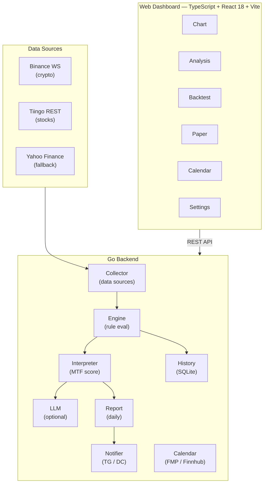

# ChartNagari

[](https://github.com/Ju571nK/ChartNagari/actions/workflows/ci.yml)
[](LICENSE)
[](go.mod)
[](Dockerfile)
[](https://www.linkedin.com/in/justin0830/)

A self-hosted platform that automatically detects ICT/Wyckoff and general TA signals across multiple timeframes (1W/1D/4H/1H) for US stocks and crypto, and delivers alerts via Telegram and Discord.

> **Local-first** — all data stays on your machine. No cloud accounts required to run.

> **Vibe-coded** — this project was built entirely through vibe coding with [Claude Code](https://claude.ai/claude-code).

---

## Features

- **Multi-timeframe analysis** — 1W, 1D, 4H, 1H scanned in parallel
- **ICT & Wyckoff signals** — order blocks, fair value gaps, liquidity sweeps, accumulation/distribution phases
- **General TA rules** — RSI, MACD, moving average crossovers, volume analysis
- **Multi-timeframe consensus** — signals are ranked by how many timeframes agree
- **AI interpretation layer** — optional LLM commentary (Anthropic, OpenAI, Groq, Gemini)
- **Telegram & Discord alerts** — configurable cooldown to prevent alert spam
- **Backtest & paper trading** — validate rules on historical data before going live
- **Web dashboard** — React frontend with Settings UI to manage .env variables at runtime
- **Multiple data sources** — Binance WebSocket (crypto, free), Tiingo (stocks, recommended), Yahoo Finance (fallback)
- **Economic calendar** — US macro event tracker (FMP or Finnhub); pre-event Telegram alerts for high-impact releases

---

## Architecture



---

## Quick Start — Docker

```bash
# 1. Clone
git clone https://github.com/Ju571nK/ChartNagari.git
cd ChartNagari

# 2. Configure
cp .env.example .env
# Edit .env — at minimum set one alert destination (Telegram or Discord)

# 3. Run
docker compose up -d

# 4. Open dashboard
open http://localhost:8080
```

---

## Quick Start — Local Dev

**Prerequisites:** Go 1.26+, Node.js 20+

```bash
# Backend
go mod download
go run ./cmd/server

# Frontend (separate terminal)
cd web
npm install
npm run dev        # dev server at :5173, proxies API to :8080
```

Or use the Makefile:

```bash
make build-all     # build frontend + backend binary
make run           # build and start server
make test          # run all Go tests
```

---

## Environment Variables

Copy `.env.example` to `.env` and fill in the values you need. The server starts without any alerts configured — you only need the variables for features you actually use.

| Variable | Required | Default | Description |
|---|---|---|---|
| `ENV` | No | `development` | `development` \| `production` |
| `SERVER_PORT` | No | `8080` | HTTP listen port |
| `LOG_LEVEL` | No | `debug` | `debug` \| `info` \| `warn` \| `error` |
| `DB_PATH` | No | `./data/chart_analyzer.db` | SQLite file path |
| `BINANCE_API_KEY` | No | — | Binance API key (public WebSocket needs no key) |
| `BINANCE_SECRET_KEY` | No | — | Binance secret |
| `TIINGO_API_KEY` | No | — | When set, Tiingo is used instead of Yahoo Finance |
| `TIINGO_POLL_INTERVAL` | No | `900` | Poll interval in seconds (free tier: 900 recommended) |
| `YAHOO_POLL_INTERVAL` | No | `60` | Yahoo Finance poll interval in seconds |
| `TELEGRAM_BOT_TOKEN` | No* | — | Token from @BotFather |
| `TELEGRAM_CHAT_ID` | No* | — | Chat, group, or channel ID |
| `DISCORD_WEBHOOK_URL` | No* | — | Discord incoming webhook URL |
| `ALERT_COOLDOWN_HOURS` | No | `4` | Hours before re-alerting same symbol+rule |
| `LLM_PROVIDER` | No | — | `anthropic` \| `openai` \| `groq` \| `gemini` |
| `ANTHROPIC_API_KEY` | No | — | Required when `LLM_PROVIDER=anthropic` |
| `OPENAI_API_KEY` | No | — | Required when `LLM_PROVIDER=openai` |
| `GROQ_API_KEY` | No | — | Required when `LLM_PROVIDER=groq` |
| `GEMINI_API_KEY` | No | — | Required when `LLM_PROVIDER=gemini` |
| `AI_MIN_SCORE` | No | `12.0` | Minimum MTF score to trigger AI interpretation |
| `LLM_LANGUAGE` | No | `en` | AI output language: `en` \| `ko` \| `ja` |
| `ALPHAVANTAGE_API_KEY` | No | — | For fetching 20-year daily SPY data |

*Alerts won't fire without at least one destination configured, but the server runs fine.

---

## Configuration Files

| File | Purpose |
|---|---|
| `config/rules.yaml` | Enable/disable individual trading rules and set their parameters |
| `config/symbols.yaml` | List of symbols to monitor (stocks and crypto) |
| `config/timeframes.yaml` | Timeframe settings for each asset class |

---

## Adding a New Rule

1. Create a file in `internal/methodology/<category>/` implementing the `rule.Rule` interface.
2. Register it in `config/rules.yaml` with a unique ID, category, and default parameters.
3. Add table-driven tests in a `_test.go` file alongside the rule.
4. Run `go test ./...` — all tests must pass before opening a PR.

See `CONTRIBUTING.md` for the full workflow.

---

## Running Tests

```bash
# All tests
go test ./...

# With race detector
go test -race ./...

# Coverage report
make test-coverage   # opens coverage.html
```

---

## Contributing

See [CONTRIBUTING.md](CONTRIBUTING.md) for development setup, code style, and PR checklist.

---

## License

MIT — see [LICENSE](LICENSE).

## Builder

Built by [Justin](https://www.linkedin.com/in/justin0830/) — exploring AI-assisted development and applying financial market knowledge through vibe coding with Claude Code.