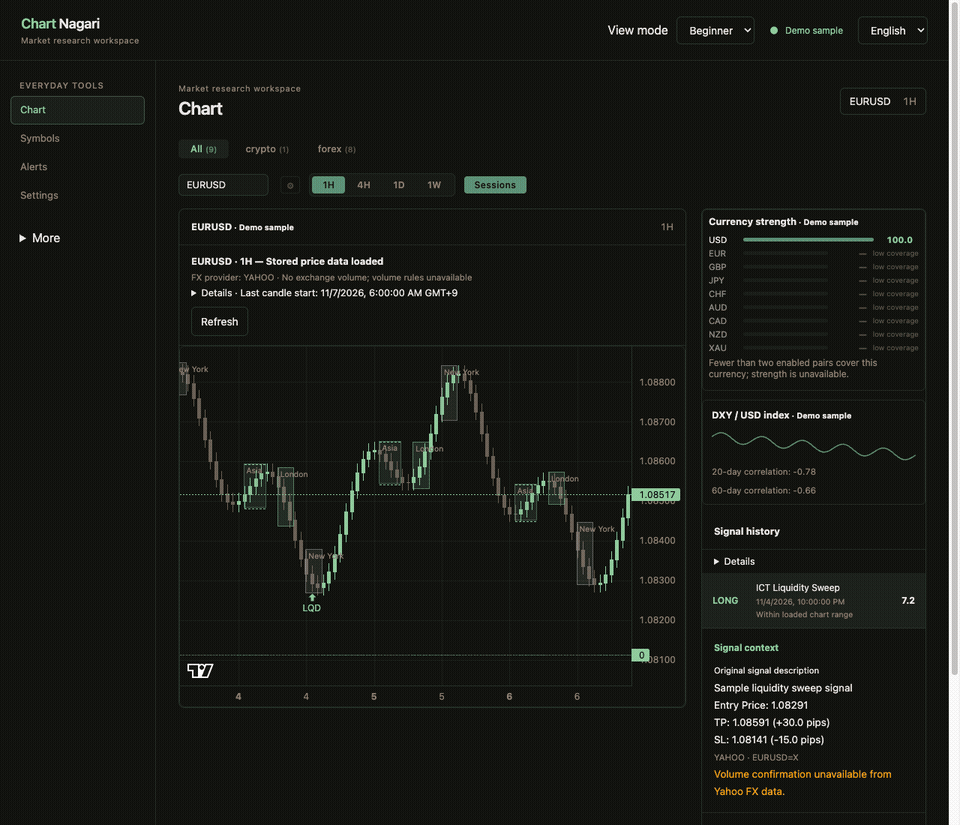

# Forex in ChartNagari

ChartNagari supports spot FX pairs and the XAUUSD/XAGUSD symbols for analysis,
alerts, chart overlays and spread-adjusted backtests. It does not place FX orders.
Forex is configured independently from stocks and crypto; Yahoo is the default
keyless source and OANDA is an optional candle-data provider.

## 5-minute keyless quick start

These steps take about five minutes once the local server is installed and running.
For a new install or build prerequisites, follow the [installation guide](getting-started.md)
first. A new install can copy `config/settings.example.yaml`; keep your existing
settings file when upgrading.

1. Open **Symbols → Forex** and add a preset such as **Majors**, or add `EURUSD`.
   FX symbols use six uppercase letters, for example `EURUSD` or `USDJPY`.
2. Wait for the first Yahoo poll, then open **Chart**, choose `EURUSD` and `1H`.
   Yahoo collection is keyless. Check Market Data Status if candles are not ready.
3. Explore the session overlay, Analysis (including currency strength), and
   Backtest. Alerts can be sent through the same optional Telegram/Discord
   integrations used for other asset classes.

The static browser demo uses bundled sample data; it does not connect to Yahoo or
OANDA.

This short browser recording is a sample/demo of the Forex interface and uses
sample data. It is not evidence of a live provider connection or release QA.

## Yahoo and OANDA

Yahoo is the default when no OANDA token is configured. Choose `yahoo` to keep
using Yahoo even when a token is saved, or choose `oanda` to request OANDA
directly. In `auto` mode, ChartNagari selects Yahoo without a saved OANDA token
and OANDA when one is saved. Canonical pairs map to
Yahoo symbols such as `EURUSD=X`; FX bars from Yahoo have zero volume. Yahoo is
convenient for a keyless start, but availability, polling limits and history are
controlled by Yahoo.

OANDA is an optional candle provider; its availability and eligibility depend
on your OANDA region and account. A practice/demo account alone does not
guarantee API access. OANDA's general v20 documentation describes practice and
live environments and access-token setup ([introduction](https://developer.oanda.com/rest-live-v20/introduction/),
[development guide](https://developer.oanda.com/rest-live-v20/development-guide/));
check the terms that apply to your division and account. For Japan, OANDA's
[API eligibility FAQ](https://help.oanda.jp/oanda/faq/show/808) (updated
2026-02-10) describes demo API requirements including a live account, Gold
membership, Pro course, agreement to the API contract, and programming
expertise. OANDA Japan's [API activation procedure](https://www.oanda.jp/lab-education/api/usage/rest_api_activation_procedure/)
specifies that the JPY 250,000 balance requirement applies to the NY server.
These Japan-specific requirements should not be generalized to every region.
Do not open or fund an account just to test this optional provider.

To use OANDA, set **Settings → Forex provider** to `auto` or `oanda`, enter an
eligible OANDA v20 personal access token, and choose `practice` or `live` as the
OANDA API environment. Practice and live are separate market-data API
environments; this setting does not connect an account for trading or submit
orders. Keep tokens private. A rejected token stops FX collection and is shown
in Market Data Status; ChartNagari does not silently switch providers.

OANDA candles use New York close alignment (17:00 New York daily boundary and
Friday weekly alignment), with native 1H, 4H, 1D and 1W candles. When the
effective provider changes, existing FX candles are purged and collected again
to avoid mixing differently aligned histories. The status reports the transition.

Yahoo 4H bars are rebuilt from complete 1H candles on the New York 17:00 trading
day boundary (17:00, 21:00, 01:00, 05:00, 09:00, 13:00 local buckets). Yahoo 1D
and 1W bars are retained as Yahoo supplies them; they are not guaranteed to use
the OANDA/New York-close convention. Do not assume daily or weekly bars from the
two providers line up candle for candle.

Yahoo's `GC=F` and `SI=F` are futures proxies for XAUUSD and XAGUSD, not spot FX
quotes. The interface labels these Yahoo metal prices as proxies. OANDA may be
selected where the relevant metal instrument is available to the account.

## Pips, volume and backtests

The display conventions are 0.0001 for most pairs, 0.01 for JPY-quoted pairs,
0.1 for XAUUSD and 0.01 for XAGUSD. The default spread assumptions are 1 pip for
the seven majors, 2 pips for other supported crosses, and 3 pips for each metal
(using that symbol's pip convention). A symbol profile can override the spread.
These are assumptions for display/backtests, not a live broker quote.

OANDA candle volume is tick volume, not centralized traded volume. Yahoo FX has
no meaningful volume and is represented with zero volume. Pure-volume rules are
skipped when volume quality is `none`; rules that use volume as confirmation can
still evaluate price structure and mark volume as unconfirmed. Tick volume is
available to volume rules, but it is not exchange volume.

FX backtests derive TP/SL from mid prices, then record `EntryPrice` and
`ExitPrice` as execution prices adjusted by half the configured/default spread
at each side. Net pips include the full round-trip spread. Paper positions show
mid/reference prices alongside spread-adjusted execution fields and net pip
results. They do not model swap/rollover, commissions, slippage, execution latency or broker-specific
fills. Historical results are simulations, not a forecast or a complete trading
cost estimate.

Both FX backtests and paper evaluation use the inherited optimistic TP-first
choice when one candle touches both TP and SL; the actual intrabar sequence is
unknown. Paper evaluation separately starts with the first fully eligible
candle after entry.
Each FX paper position keeps its original provider, environment, mapped
instrument and proxy identity. A source mismatch suspends evaluation while
preserving history; a legacy FX position with unknown source is also suspended.

Four-hour-only backtests cannot provide an exact Asian range. In that case the
range is marked unavailable and AMD does not infer it from 4H bars; hourly
history is required for exact AMD evaluation. Live session overlays use 1H data
even when the chart displays 4H.

## Sessions and daylight saving time

Forex collection and analysis follow the FX week: Sunday 17:00 through Friday
17:00 America/New_York, with Christmas Day and New Year's Day closed. Intraday
polling pauses over the weekend; 1D/1W collection can still run. Session boxes
and ICT kill zones use New York local time and therefore move in UTC when the US
changes daylight saving time. The kill-zone timing change applies to all asset
classes, including existing stock and crypto users. Calendar and session times
should be read in their displayed timezone.

See [settings and upgrades](../SETTINGS.md), [release notes](releases/v2.14.0.0.md),
and [contributor guide](../CONTRIBUTING.md) for configuration and implementation
details.
