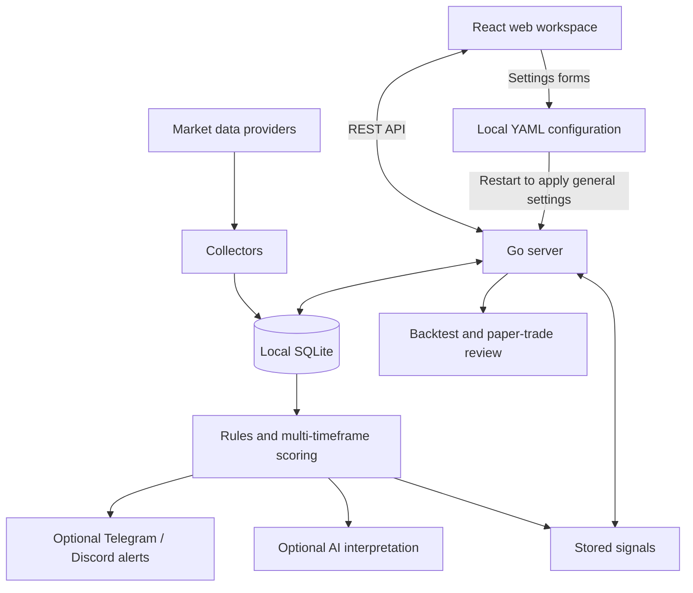

# Architecture

This technical overview lives outside the product README. For installation, see
[Getting started](getting-started.md); for code and tests, see [Contributing](../CONTRIBUTING.md).

## Boundaries that matter

- **Market data:** Binance for crypto; Tiingo or Yahoo for stocks. Index symbols
  such as `^VIX` use the Yahoo daily collector independently of the Tiingo key.
- **Chart overlays:** FVG/OB candidates are calculated from the selected candles
  in the frontend. They are separate from the backend engine's stored signals.
- **Configuration:** `settings.yaml` contains general settings and credentials;
  watchlists, alert rules and execution registration use their respective YAML
  files. General settings are persisted rather than hot-reloaded. See [Settings](../SETTINGS.md).
- **Execution:** the Alpaca paper adapter is a separate process. Saving settings
  neither launches it nor enables the server's execution controls.
- **Privacy:** SQLite and configuration are local; enabled integrations still
  exchange information with their external providers.

## Entry points

| Location | Responsibility |
|---|---|
| `cmd/server` | Application startup and service wiring |
| `internal/api` | Web API and settings persistence |
| `internal/collector` | Market-data collection |
| `internal/pipeline`, `internal/methodology` | Signal processing and trading rules |
| `internal/storage` | SQLite persistence |
| `web/src` | Workspace, charts and configuration forms |
| `cmd/chartnagari-mcp`, `cmd/plugin-alpaca` | Independent integration processes |

The diagram describes the main relationships, not every runtime goroutine or API route.
