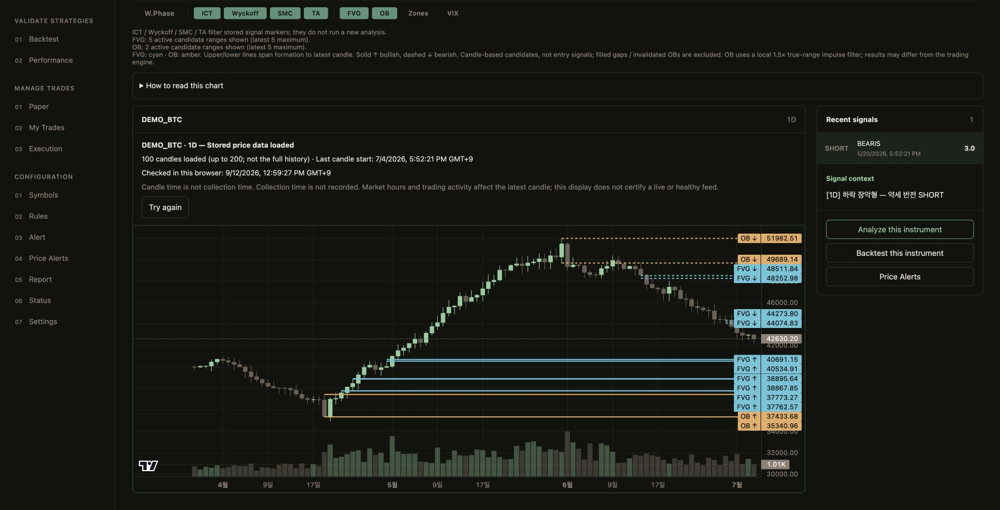
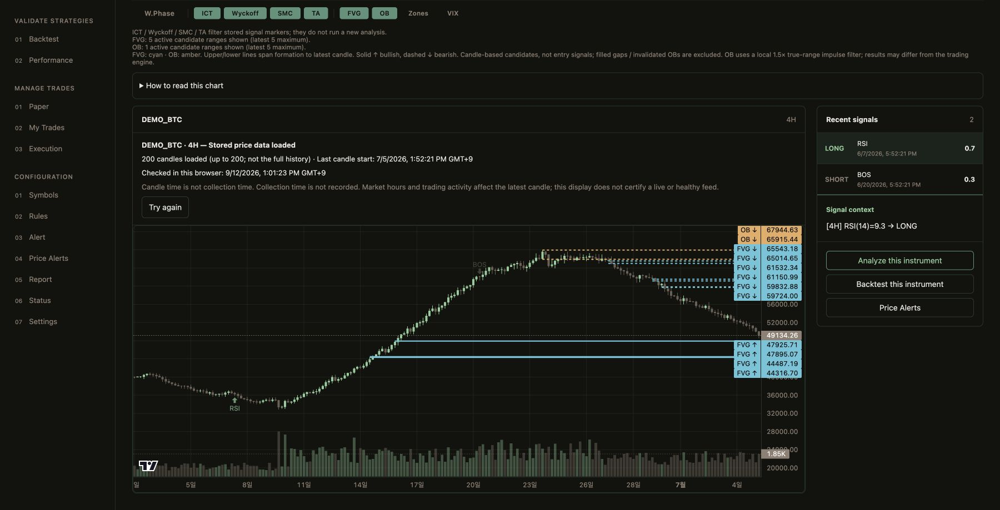
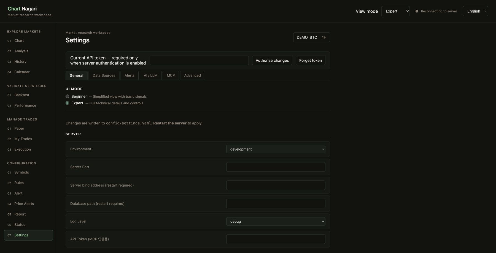

# Current workspace screenshots

Captured in Chrome on **2026-09-12**, from the main build at **6558f1c**.
These are actual application screenshots, not generated mockups.

The build used static demo fixtures: candle timestamps belong to the stored
sample dataset, not the capture date. No user watchlist, API keys, accounts or
orders were used. The static build has no live server connection; its header's
connection indicator and empty settings fields must not be read as a live-service
health or configuration demonstration. Settings persistence is available in the
self-hosted application, not in this static capture.

## Expert chart — daily



## Same instrument — four-hour timeframe



## Web-managed settings



## Animated tour

The README GIF is a three-scene, 12-second slideshow of these captures. No result,
status indicator or chart label was retouched. Original JPEG captures are retained above.

Build a separate capture bundle without replacing the running server's frontend:

```sh
cd web
VITE_DEMO_STATIC=true npm exec vite build -- --outDir ../bin/readme-demo --base /
npm exec vite preview -- --outDir ../bin/readme-demo --host 127.0.0.1 --port 8769
```

Open the local page in Chrome, dismiss onboarding, choose Expert, enable FVG/OB,
and capture 1D, 4H and Settings. The chart captures are scrolled to show the whole
chart; they keep the application annotations and TradingView attribution.

Rebuild the GIF from these captures, from the repository root:

```sh
ffmpeg -y -f concat -safe 0 -i docs/screenshots/tour.ffconcat -t 12 \
  -filter_complex "fps=2,scale=1200:-1:flags=lanczos,split[a][b];[a]palettegen[p];[b][p]paletteuse" \
  -loop 0 docs/demo.gif
```
